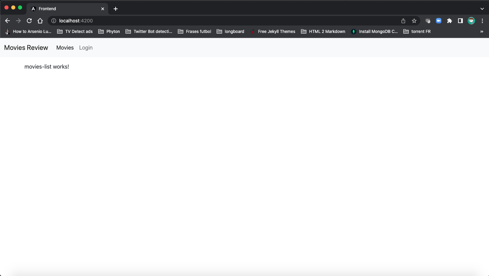

# Beginning MEAN Stack Development

Examples of the book `Beginning MEAN Stack Development` by `Greg Lim`


There is a branch for each chapter, starting from chapter 6 on.

Steps to start your Server

```
git clone https://github.com/joaquinOnSoft/BeginningMEANStackDevelopment.git
cd BeginningMEANStackDevelopment
node init
node Index.js
```

Or, if you are in the middle of your development/test

```
git clone https://github.com/joaquinOnSoft/BeginningMEANStackDevelopment.git
cd BeginningMEANStackDevelopment
node init
nodemon server
```

To launch the fronted, just execute these commands:

```
cd frontend
ng server --open
```

Opent this URL in your browser:

```
http://localhost:4200/
```

You will see something like this:

